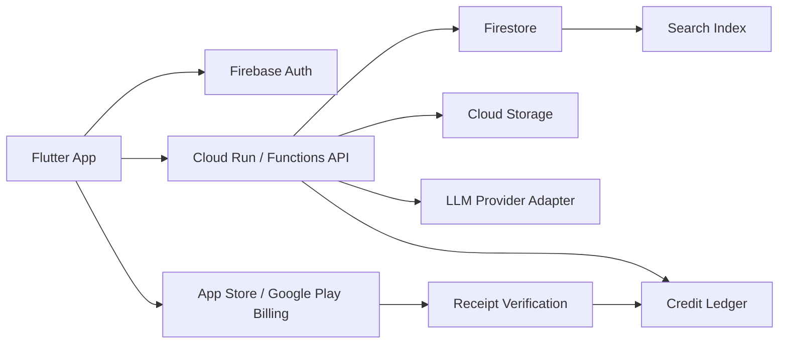

# PersonaChat - AI Character Chat App

## Goal

Flutter 개발자 공고에서 반복되는 실무 요구사항을 한 프로젝트 안에서 증명하는 AI 캐릭터 채팅 서비스다. 사용자는 SNS로 로그인하고, 직접 만든 캐릭터 설정을 저장하며, 해시태그와 검색으로 캐릭터를 찾고, 카카오톡에 익숙한 대화형 UI에서 크레딧을 사용해 AI와 대화한다.

## Job Posting Analysis

분석일: 2026-07-12

원티드 Flutter 검색 결과 19개 활성 공고와 주요 상세 공고를 확인했다.

대표 공고:
- 쿠팡 `Sr Flutter Engineer`: Flutter/Dart, BLoC/Cubit, Clean Architecture, Dio, WebSocket, Firebase, Mockito, Patrol, CircleCI
- 제네시스네스트 `Flutter App 개발자`: 상태관리, RESTful API, Swift/Kotlin, Git 협업, 앱 출시/유지보수, CI/CD
- 에이피알 `Flutter 개발자`: Figma UI 구현, 테스트 자동화, Patrol E2E, SonarQube, Fastlane/GitHub Actions
- 위버스마인드 `AI 기반 학습앱 Android, Flutter 개발자`: Firebase, Riverpod, BloC, dio, retrofit, freezed, AI 개발 도구

반복 키워드:
- Flutter/Dart, 출시, 유지보수, Git 협업
- Riverpod/BLoC/Provider/GetX 등 상태관리
- HTTP/REST/Dio/Retrofit, Firebase, WebSocket
- Clean Architecture, MVVM
- 테스트, E2E, Patrol, Flutter Test, Mockito, SonarQube
- CI/CD, GitHub Actions, Fastlane, Jenkins
- 결제, AI, 크로스플랫폼 서비스 경험

이 프로젝트는 단순 UI 클론이 아니라 인증, 데이터 모델링, 검색, 결제 검증, AI 스트리밍, 테스트 자동화까지 포함해 경력 공고의 핵심 키워드를 실제 흐름으로 연결한다.

## Product Scope

### Core User Flow

1. 사용자가 Google, Apple, Kakao 중 하나로 로그인한다.
2. 캐릭터 탐색 화면에서 해시태그, 인기순, 최신순, 검색어로 캐릭터를 찾는다.
3. 캐릭터 상세에서 세계관, 말투, 금지 설정, 이벤트 이미지 예시, 대화 비용을 확인한다.
4. 사용자가 직접 캐릭터를 만들고 공개/비공개 여부와 태그를 저장한다.
5. 채팅방에서 캐릭터와 대화한다. 메시지 전송 전 예상 크레딧을 보여주고, 응답 완료 후 실제 사용량을 차감한다.
6. 특정 조건이 충족되면 대화 중간에 이벤트 이미지가 말풍선 사이에 노출된다.
7. 크레딧이 부족하면 충전 화면으로 이동하고, 모바일에서는 App Store/Google Play 인앱 결제로 구매한다.

### MVP Features

- SNS 로그인: Firebase Auth 기반 Google/Apple, Kakao는 OIDC 또는 백엔드 커스텀 토큰 방식
- 캐릭터 CRUD: 프로필, 성격, 말투, 세계관, 첫 메시지, 금지어, 공개 범위, 태그
- 캐릭터 검색: Firestore 인덱스 기반 MVP, 확장 시 Algolia 또는 Meilisearch 연동
- 채팅: 메시지 스트리밍, 재시도, 중단, 신고, 대화 히스토리
- 이벤트 이미지: 조건 기반 이미지 삽입, Storage URL 관리, 로딩/실패 상태
- 크레딧 결제: consumable product, 영수증 검증, 서버 원장, 환불/복구 처리
- 운영 기능: Remote Config, Crashlytics, Analytics, App Check, 기본 콘텐츠 모더레이션

## Recommended Stack

- App: Flutter, Dart, Material 3, Riverpod, go_router
- Network: Dio, Retrofit, freezed/json_serializable
- Backend: Firebase Auth, Cloud Firestore, Cloud Functions or Cloud Run, Cloud Storage
- AI: LLM Provider Adapter, streaming API, safety/moderation layer, prompt versioning
- Search: Firestore composite indexes for MVP, Algolia/Meilisearch for production scale
- Payment: `in_app_purchase`, App Store Server API, Google Play Developer API, server-side receipt verification
- QA: Flutter Test, golden/widget tests, Mockito, Patrol E2E, GitHub Actions, SonarQube

## Architecture

앱은 feature-first 구조로 나눈다.

- `features/auth`: 로그인, 계정 연결, 로그아웃
- `features/characters`: 목록, 검색, 상세, 생성/수정
- `features/chat`: 채팅방, 스트리밍, 이벤트 이미지, 신고
- `features/credits`: 잔액, 상품, 구매, 복구
- `core`: routing, networking, error, theme, analytics
- `data`: DTO, repository, remote/local datasource

## Data Model

### users

- `uid`
- `displayName`
- `photoUrl`
- `providers`
- `creditBalance`
- `createdAt`
- `lastSeenAt`

### characters

- `characterId`
- `ownerUid`
- `name`
- `avatarUrl`
- `summary`
- `personaPrompt`
- `scenario`
- `firstMessage`
- `hashtags`
- `visibility`
- `messageCost`
- `eventImageRules`
- `stats`
- `createdAt`
- `updatedAt`

### chatRooms

- `roomId`
- `userUid`
- `characterId`
- `lastMessage`
- `totalCreditsSpent`
- `createdAt`
- `updatedAt`

### messages

- `messageId`
- `role`: user, assistant, system, eventImage
- `content`
- `imageUrl`
- `creditCost`
- `tokenUsage`
- `status`: pending, streaming, completed, failed
- `createdAt`

### creditLedger

- `ledgerId`
- `uid`
- `type`: purchase, spend, refund, adjustment
- `amount`
- `balanceAfter`
- `sourceId`
- `receiptHash`
- `createdAt`

결제 원장은 클라이언트 잔액을 신뢰하지 않는다. 채팅 요청은 서버에서 잔액 확인, 예약 차감, AI 응답 생성, 최종 정산 순서로 처리한다.

## Payment Notes

모바일 앱에서 AI 대화 크레딧처럼 앱 안에서 소비되는 디지털 재화는 스토어 정책상 인앱 결제를 기준으로 설계한다.

- Android: Google Play 정책은 앱 기능, 디지털 콘텐츠, 캐릭터/아바타/가상화폐 같은 인앱 구매에 Google Play 결제 사용을 요구한다.
- iOS: App Store Review Guidelines 3.1.1 기준으로 앱 내 디지털 기능 잠금 해제는 인앱 구매로 설계한다.
- Web: 웹 배포판은 Toss Payments 또는 Stripe를 별도 결제 채널로 붙일 수 있지만, 모바일 앱 안에서 외부 결제로 우회하지 않는다.

## Screens

1. Onboarding/Login
2. Character Discovery
3. Character Detail
4. Character Editor
5. Chat Room
6. Credit Store
7. Purchase History
8. My Characters
9. Report/Block Flow

## Testing Strategy

- Unit: credit calculator, prompt builder, hashtag parser, receipt status mapper
- Widget: login states, character card, chat bubble, event image tile, insufficient credit dialog
- Repository: fake Firestore/API를 이용한 success/failure 테스트
- E2E: 로그인 대체 모드, 캐릭터 생성, 검색, 채팅, 크레딧 부족, 구매 복구
- CI: `flutter analyze`, `flutter test`, Patrol smoke test, coverage report

## Portfolio Proof Points

이 프로젝트를 포트폴리오에 올릴 때는 다음 산출물을 함께 보여준다.

- 아키텍처 다이어그램과 데이터 모델
- 결제 영수증 검증과 크레딧 원장 설계
- 실제 채팅 스트리밍 UI 녹화
- 캐릭터 생성/검색/해시태그 데모
- 테스트 결과와 CI 배지
- App Store/Play Store 정책을 고려한 결제 설계 근거
- 본인 기여도: 기획, Flutter 앱 구조, Firebase 설계, 결제/AI 연동, 테스트 자동화

## Milestones

### Week 1 - Foundation

- Flutter 앱 구조, Riverpod, routing, theme
- Firebase Auth 로그인 플로우
- 캐릭터 목록/상세/생성 UI mock
- Firestore security rules 초안

### Week 2 - Character And Chat

- 캐릭터 CRUD와 해시태그 검색
- 채팅방 UI, 메시지 저장, 스트리밍 상태
- prompt builder와 LLM adapter mock
- 이벤트 이미지 룰과 렌더링

### Week 3 - Credits And Payment

- 크레딧 상품/잔액/원장
- `in_app_purchase` 구매 플로우
- 서버 영수증 검증 mock
- 부족/실패/복구 케이스 처리

### Week 4 - Quality And Portfolio

- 테스트 자동화, Patrol E2E
- Crashlytics/Analytics/Remote Config
- 데모 영상, README, 기술 회고
- 포트폴리오 카드와 상세 문서 연결

## Source Links

- Wanted Flutter search: https://www.wanted.co.kr/search?query=flutter&tab=position
- Coupang Flutter posting: https://www.wanted.co.kr/wd/323168
- Genesis Nest Flutter posting: https://www.wanted.co.kr/wd/361377
- APR Flutter posting: https://www.wanted.co.kr/wd/359394
- Weaversmind AI Flutter posting: https://www.wanted.co.kr/wd/330372
- Apple App Review Guidelines: https://developer.apple.com/app-store/review/guidelines/
- Google Play Payments policy: https://support.google.com/googleplay/android-developer/answer/9858738
- Google Play Billing docs: https://developer.android.com/google/play/billing
- Flutter `in_app_purchase`: https://pub.dev/packages/in_app_purchase
- Firebase Auth federated sign-in: https://firebase.google.com/docs/auth/flutter/federated-auth
